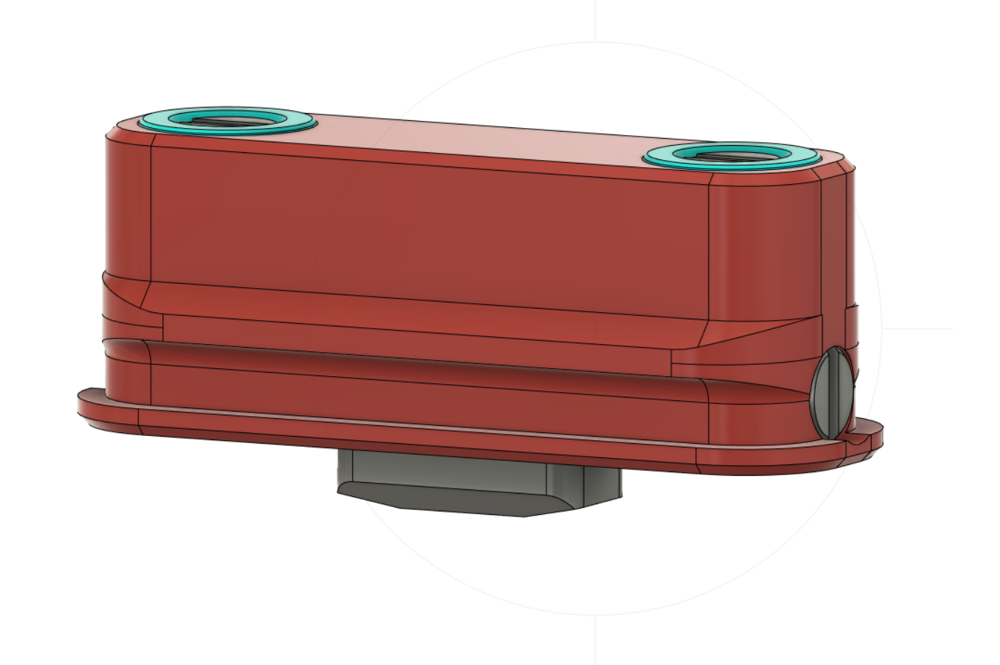

# Unclid Probe (replacement)

This is a Replacement for the Euclid Probe. (only probe PCB)

A Combination of [Euclid Probe](https://euclidprobe.github.io/) and [Unklicky](https://github.com/majarspeed/Unklicky).

However design is heavily based on [SlideSwipe](https://github.com/chestwood96/SlideSwipe)

Bom
| Name | Pieces |
| ------ | ------ |
| Stock Euclid Magnets | 2 |
| M2x10MM | 2 |
| M3x8MM | 2 |
| 6x3MM Magnet | 2 |

Switch is NC. (design heavily based on Chestwood96's SlideSwipe design)

I started with me messing up a PCB of the Euclid probe while desoldering a D2F thats been at the end of it's life.

Started to mess around with a printable alternative of the euclid PCB but ultimatively ended up with this because its so much better than a microswitch.

Works with the Original Euclid Dock!

