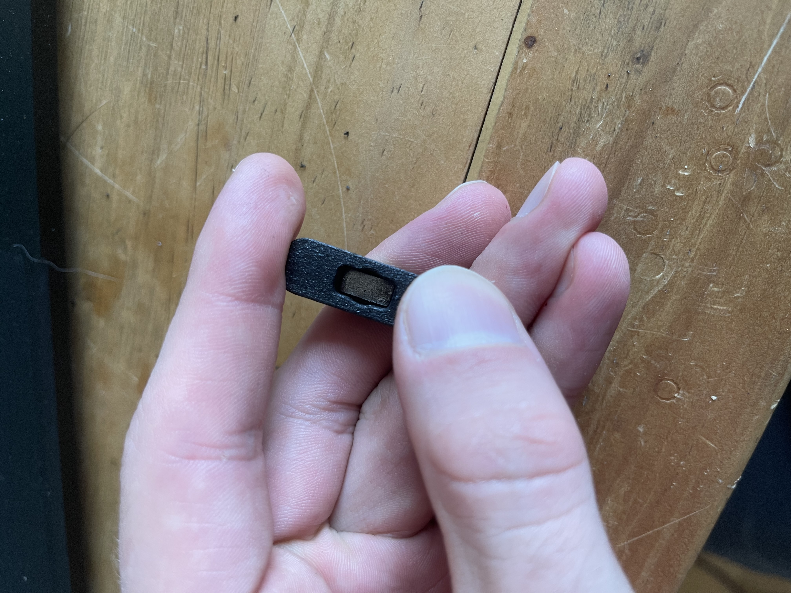

# Unclid Probe (EUCLID PROBE replacement)

This is a direct replacement for the Euclid Probe.

This is only replacing the lower PCB, which means it doesnt matter if youre using a 24v or 5v euclid.

A Combination of [Euclid Probe](https://euclidprobe.github.io/) and [Unklicky](https://github.com/majarspeed/Unklicky).

However design is heavily based on [SlideSwipe](https://github.com/chestwood96/SlideSwipe)

Bom
| Name | Pieces |
| ------ | ------ |
| Stock Euclid Magnets | 2 |
| M1.6 x 6MM | 2 |
| M2 x 10MM | 2 |
| 6x3MM Magnet | 1|
| 10x5x2MM Magnet | 1|

Switch is NC. (design heavily based on Chestwood96's SlideSwipe design)

Works with the Original Euclid Dock without any modifications! (ofc you might need to modify your coords)

it works with auto-z too, i will post offsets etc. soon but you might figure it out by yourselfs for now.

ASSEMBLY INSTRUCTIONS

Push 10x5x2MM Magnet down into Base

Push 6x3MM Magnet into Pin

Screw Down Euclid Magnets using M1.6X6MM Screws

Screw in M2x10MM halfway, put pin inside and screw in all the way

Enjoy your Magnetic Switch!

